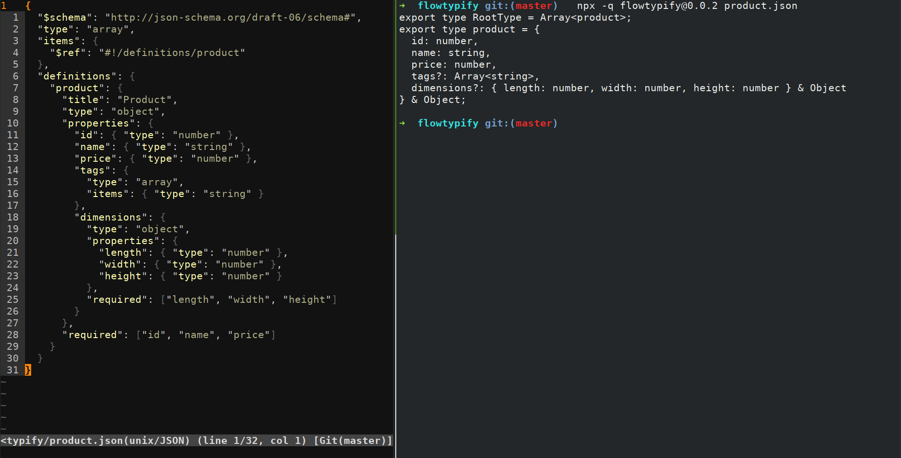

[](https://badge.fury.io/js/flowtypify)

[](https://travis-ci.org/rradczewski/flowtypify)
[](https://david-dm.org/rradczewski/flowtypify) [](https://david-dm.org/rradczewski/flowtypify)

# Flowtypify - Generate Flowtype Definitions from JSON Schemas

`Flowtypify` generates flowtype definitions from a given JSON Schema. This enables you to type-check the contract your app is working against. Whenever you update the schema, regenerate the flowtype definitions and flow will tell you about breaking changes.

Version-wise its an early Proof of Concept, but the [testsuite](test/scenarios/) already covers most of the features I've seen in the wild so far.

## Usage

Invoking `fowtypify` will parse the JSON schemas and output the types to `STDOUT`. With `--write` enabled, a file with the same basename plus `.flow.js` will be created for each supplied schema.

```shell
npm install --save-dev flowtypify
./node_modules/.bin/flowtypify --write src/schematas/*.json
```


## FAQ

### Flowtypify generates lots of unsealed types (`& Object`)

Yepp, that's, apart from the lack of any optimizations in `flowtypify`, due to your schema not having `additionalProperties: false` set on object definitions you have.

## What works?

Everything in [test/scenarios](test/scenarios) works, the following does not work, yet ;)

- [ ] Transformations
  - [ ] Change `RootType` name
  - [ ] Transform Type names (e.g. uppercase)
  - [ ] Custom transformations (e.g. `Optional<*>` types)
- [ ] Resolve external `$ref` links
